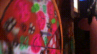
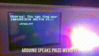
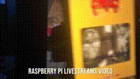

# The Slice is Right
Arduino code for the immersive art exhibit the Slice is Right. This project played a video on loop from a Raspberry Pi. The player spun a prize wheel,
and an Arduino used hall-effect and reflected light sensors to check for a win state. If a win was detected, the Raspberry Pi switched the video and
triggered another Arduino to display a message on an LCD screen and speak a message with a TTS chip. The message notified the player that they were
on a livestream hosted by another Raspberry Pi nd provided them with a hyperlink where they could view themselves.

# Nothing Cheezy
[Nothing Cheezy](https://thinktank.gallery/nothingcheezyartists) was an immersive art exhibit in LA put on by Think Tank Gallery featuring a variety of artists.

# Hardware

# Media from the Show
Wheel and Raspberry Pi Video Feed  

  

Text to Speech LCD 

  

Livestream 

  

## [Video](https://vimeo.com/manage/videos/865837533)

